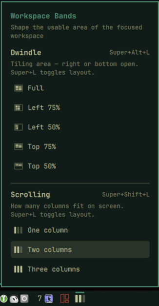

# Workspace Bands

Omarchy bar widget by **Agile Automation** for shaping the focused workspace.

**Dwindle** locks tiling into a left or top band at 50% or 75%, so the right or bottom of the screen stays open for floating windows, reference apps, or empty space. Options: Full, Left 75%, Left 50%, Top 75%, Top 50%.

**Scrolling** sets how many columns fit on screen — one, two, or three — and updates existing columns live (`colresize all`).

Both modes are **key-driven** as well as clickable: open the dropdown from the bar icon, or cycle without leaving the keyboard.



> Like all Omarchy shell plugins, this runs **unsandboxed** inside `omarchy-shell`
> and can run `hyprctl` / shell snippets. Read the source before installing.

## Install

```bash
omarchy plugin add https://github.com/unipsycho/omarchy-workspace-bands.git --enable
# ensure the CLI is on PATH for optional terminal use:
ln -sfn ~/.config/omarchy/plugins/agileautomation.workspace-bands/bin/omarchy-workspace-bands \
  ~/.local/bin/omarchy-workspace-bands
```

Add keybinds in `~/.config/hypr/bindings.lua`:

```lua
o.bind("SUPER + SHIFT + L", "Cycle scrolling columns", "omarchy-shell agileautomation.workspace-bands cycle")
o.bind("SUPER + ALT + L", "Cycle tiling area", "omarchy-shell agileautomation.workspace-bands cycleBand")
```

(`Super + Ctrl + L` is Omarchy Lock — do not reuse it.)

### Persist scrolling column width across reload

In `~/.config/hypr/looknfeel.lua`, after your defaults:

```lua
do
  local state = (os.getenv("HOME") or "") .. "/.local/state/omarchy/workspace-bands/config.lua"
  local f = io.open(state, "r")
  if f then f:close(); dofile(state) end
end
```

## Usage

Click the bar icon for a dropdown with both sections. Hotkeys cycle within each mode.

| Shortcut | Action |
|----------|--------|
| `Super + L` | Toggle dwindle ↔ scrolling (Omarchy default) |
| `Super + Shift + L` | Cycle scrolling columns |
| `Super + Alt + L` | Cycle dwindle bands |

Picking a **Scrolling** option switches that workspace to scrolling, clears any band, sets `scrolling:column_width`, and runs `colresize all` so existing columns update live. Picking a **Dwindle** option switches to dwindle and applies the band via asymmetric `gaps_out`.

## CLI / IPC

```bash
omarchy-workspace-bands get|set 1|2|3|cycle
omarchy-shell agileautomation.workspace-bands set 1
omarchy-shell agileautomation.workspace-bands band left-75
omarchy-shell agileautomation.workspace-bands cycleBand
omarchy-shell agileautomation.workspace-bands toggle
```

## Conflict with Panes

[rogergdot.panes](https://github.com/RogerGdot/omarchy-panes) also writes workspace gap rules. Prefer one widget for band control. This plugin uses `band-*.lua` state files (not `pane-*.lua`).

## Uninstall

```bash
omarchy plugin remove agileautomation.workspace-bands
rm -f ~/.local/state/omarchy/workspace-layouts/band-*.lua
rm -rf ~/.local/state/omarchy/workspace-bands
rm -f ~/.local/bin/omarchy-workspace-bands
# remove the keybinds from ~/.config/hypr/bindings.lua and the looknfeel dofile block
```

## License

MIT — see [LICENSE](LICENSE).
